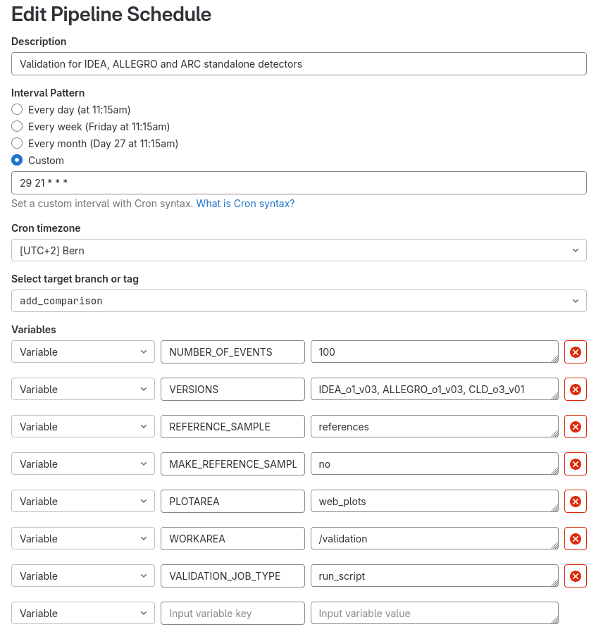

# CERN Summer School 2024: <br> New Developments in Full Simulation Software for FCC

## Table of Contents
- [Main Purpose of the Project](#main-purpose-of-the-project)
- [How Does the Pipeline Work?](#how-does-the-pipeline-work)
  - [Pipeline Variables](#pipeline-variables)
  - [Pipeline Stages](#pipeline-stages)
    - [Setup](#setup)
    - [Execute Scrpits](#execute-scripts)
    - [Make Plots](#make-plots)
    - [Make Web](#make-web)
    - [Deploy](#deploy)
    - [Cleanup](#cleanup)
- [Scalability: Adding a New Detector Concept](#scalability-adding-a-new-detector-concept)
  - [Bash Script](#bash-script)
    - [Simulation and Reconstruction](#simulation-and-reconstruction)
    - [Analysis and ROOT File Structure](#analysis-and-root-file-structure)
  - [Where to Place the Code: Creating the correct *key4hep-reco-validation* Directory](#where-to-place-the-code-creating-the-correct-key4hep-reco-validation-directory)
  - [Add the new Detector Concept to the Pipeline](#add-the-new-detector-concept-to-the-pipeline)
  - [Considerations on the Website](#considerations-on-the-website)
- [Conclusions](#conclusions)

<br>

# Main Purpose of the Project

The main idea of this project is developing new tools for the **validation of the FCC software**. Software validation is a fundamental step in the software development lifecycle, and is needed to ensure that the final products meets the specified requirements and fulfills its intended purpose. <br>
In the context of this work, this means making sure that, even though the code may compile and run without any issues, the physics results that we obtain from the simulations and analyses are compatible with what we expect. 

In order to achieve these goals, we use a **GitLab CI/CD pipeline** to run daily automated tests using the new versions of the code available. The results of these tests, comparing the output of new versions with reference stable ones, can be checks on [key4hep validation website](https://key4hep-validation.web.cern.ch/index.html).

Please note that this pipeline is *not* useful in case the software is broken: the verification of the software is tested by cron jobs in other repositories.


<br>

# How Does the Pipeline Work?

## Pipeline Variables

The pipeline acts as a long bash script, whose behaviour can be controlled through specific **pipeline variables**. These variables are defined at the [beginnig of the pipeline](https://gitlab.cern.ch/key4hep/k4-validation/-/blob/add_comparison/.gitlab-ci.yml?ref_type=heads#L1-49), and can be set to the desired values when instantiating a new pipeline via the *Pipeline Schedule Editor*. <br>
Here is the list of the variables used in this specific pipeline:

1. **VALIDATION_JOB_TYPE**: Which type of validation job to run. In order to use the new version of the pipeline, please select *run_script*.
2. **VERSIONS**: List of detector versions that need to tested, separated by a comma (e.g. "ALLEGRO_o1_v03, IDEA_o1_v03, CLD_o3_v01").
3. **MAKE_REFERENCE_SAMPLE**: Whether to store the output of the simulation and reconstruction phase as a reference for future use or new results to be checked.
4. **WORKAREA**: Where to run the validation on the runner.
5. **PLOTAREA**: Where to store the plots and information for the validation website on the runner (path relative to *WORKAREA*).
6. **REFERENCE_SAMPLE**: Where to find the reference sample on the runner (path relative to *WORKAREA*).
7. **NUMBER_OF_EVENTS**: How many events to run in the simulation step.
8. **TAG**: Which tag to use for the key4hep release
9. **CI_OUTPUT_DIR**: Path to the web page files, needed for the website deployment.

## Pipeline Stages

The pipeline main process is divided into so-called **stages**, logically distinct steps that are run in a specified order. Stages can contain multiple **jobs** that are run concurrently, though in this pipeline each stage only has one specific job assigned to it.
The execution of the stages can depend on the global pipeline variables set at the start or on the success of the previous stages, providing a very flexible way to handle different situations.

### [Setup](https://gitlab.cern.ch/key4hep/k4-validation/-/blob/add_comparison/.gitlab-ci.yml?ref_type=heads#L84-117)

The first stage of the pipeline is tasked with cleaning up the working directory of any trace of previous iterations of the pipeline for the detector versons to be tested, and/or create the necessary directories if they are not present yet. It also clones the [key4hep-reco-validation](https://github.com/key4hep/key4hep-reco-validation) containing the scripts that will be executed in the next stage.

### [Execute Scripts](https://gitlab.cern.ch/key4hep/k4-validation/-/blob/add_comparison/.gitlab-ci.yml?ref_type=heads#L120-153)

In this stage, as the name implies, the scripts for the tests are executed. In order for this stage to work properly, care should be put into following the proper structure and naming conventions.

The bash scripts to be executed are contained in the *key4hep-reco-validation/* directory, downloaded in the previous step. This repository is structured to mirror the [k4geo repository](https://github.com/key4hep/k4geo/tree/main/FCCee), so that each detector concept and the path leading to its files are individuated by its **geometry** (its generic name, e.g. *ALLEGRO*) and its **version** (the geometry followed by the option and version number, e.g. *ALLEGRO_o1_v03*). <br>
An example structure would look like this:
```
key4hep-reco-validation/
└── scripts/
    └── FCCee/
        ├── ALLEGRO/
        |   └── ALLEGRO_o1_v03/
        |       └── ALLEGRO_o1_v03_script.sh
        ├── IDEA/
        |   └── IDEA_o1_v03/
        |       └── IDEA_o1_v03_script.sh
        ├── CLD/
        |   ├── CLD_o2_v06/
        |   |   └── CLD_o2_v06_script.sh
        |   └── CLD_o3_v01/
        |       ├── CLD_o3_v01_script.sh
        |       └── ARC_standalone_script.sh
        └── utils/
``` 

For each of the detector versions specified in the *VERSIONS* list, the *GEOMETRY* is defined by extracting the substring before the first underscore character.
For each geometry-version pair thus found, the bash scripts contained in the *key4hep-reco-validation/scripts/FCCee/GEOMETRY/VERSION* directory are executed. To be recognised as such, their file name must end in *_script.sh*. <br>
For example, using the example *key4hep-reco-validation* shown above, if the *VERSIONS* list contains *CLD_o3_v01* both *CLD_o3_v01_script.sh* and *ARC_standalone_script.sh* will be run.

These scripts are not properly part of the pipeline and should be submitted by the users, but ideally they should include a simulation (and optionally reconstruction) steps, followed by the desired analyses and checks. Their output must be a ROOT file containing the histograms of the variable of interest. This ROOT file must also follow a strict structure, where each TH1 object is stored inside a TDirectory whose name reflects the subsystem that is currently being analyzed. <br>
See [this section](#analysis-and-root-file-structure) for further comments on how to properly create these scripts and what structure to follow.

Finally, at the end of this stage the output ROOT files are saved in the correct reference folders if the *MAKE_REFERENCE_SAMPLE* variable is set to "yes".

### [Make Plots](https://gitlab.cern.ch/key4hep/k4-validation/-/blob/add_comparison/.gitlab-ci.yml?ref_type=heads#L156-188)

The [plotting script](https://github.com/enlupi/key4hep-reco-validation/blob/validation_project/scripts/FCCee/utils/plot_histograms.py) is run on all the output ROOT files produced in the previous step. This script checks all the histograms saved inside a file and compares them to a reference file, producing plots of the two distributions with different backgrounds depending on the outcome of the comparison: white if they match, red if they do not, and yellow if the reference histogram could not be found.

Three tests to compare the histograms are available:
1. Check if all bins have exactly the same edges and number of entries.
2. Chi squared test.
3. Kolmogorov-Smironov test.

This stage is only executed if the *MAKE_REFERENCE_SAMPLE* variable is set to "no".

### [Make Web](https://gitlab.cern.ch/key4hep/k4-validation/-/blob/add_comparison/.gitlab-ci.yml?ref_type=heads#L191-230)

This stage is responsible of creating the html files for the static website by running a [python script](https://github.com/enlupi/key4hep-reco-validation/blob/validation_project/web/python/make_web.py). <br>
Information about the current release of *key4hep* is also collected and stored to a file, to be included into the website.

This stage is only executed if the *MAKE_REFERENCE_SAMPLE* variable is set to "no".

### [Deploy](https://gitlab.cern.ch/key4hep/k4-validation/-/blob/add_comparison/.gitlab-ci.yml?ref_type=heads#L233-259)

As the name implies, this stage simply deploys the website.

This stage is only executed if the *MAKE_REFERENCE_SAMPLE* variable is set to "no".

### [Cleanup](https://gitlab.cern.ch/key4hep/k4-validation/-/blob/add_comparison/.gitlab-ci.yml?ref_type=heads#L262-275)

A final cleanup is done to remove the *key4hep-reco-validation* cloned in  the *setup* stage and the metadata file with the key4hep release info created in the *make_web* step. <br>
Note that all the other files produced by the pipeline will not be deleted until the *setup* stage in the next pipeline execution, so that they can be further inspected in case of issues.

<br>

# Scalability: Adding a new Detector Concept 

The pipeline has been designed with flexibility in mind, so that adding new detector concepts to be tested would be as easy and straightforward as possible. Here are the necessary **steps to follow**:
1. Create a bash script to simulate the detector and produce a ROOT file with the distributions of interest.
2. Add the new scripts to the correct directory in the *key4hep-reco-validation* repository.
3. Add the new detector concept to th *VERSIONS* list variable in the pipeline

Let's see them more in details.

## Bash Script

The main ingredient needed is the bash script run in the [*execute_scripts* stage](#execute-scripts). Remember that the script should have a **unique name that ends with *_script.sh***, so that the pipeline can recognize it as one of the scripts to execute. <br>
The goal of this script is to **produce a ROOT file** with a specific structure containing histograms. The way to actually arrive to this results depends on the detector to be analyzed and should be decided by each user, though there is a general guideline that can be followed. You may look at the [script for *ALLEGRO_o1_v03*](https://github.com/enlupi/key4hep-reco-validation/blob/validation_project/scripts/FCCee/ALLEGRO/ALLEGRO_o1_v03/ALLEGRO_o1_v03_script.sh) as an example.

### Simulation and Reconstruction

The script should contain a step to simulate and optionally reconstruct the events. This can usually be done with an appropriate script present in **FCCConfig**, see e.g. the [sim-digi-reco for *ALLEGRO_o1_v03*](https://github.com/HEP-FCC/FCC-config/blob/main/FCCee/FullSim/ALLEGRO/ALLEGRO_o1_v03/ctest_sim_digi_reco.sh), which can simply be sourced with the command:
```
source $FCCCONFIG/share/FCC-config/FullSim/ALLEGRO/ALLEGRO_o1_v03/ctest_sim_digi_reco.sh
```

### Analysis and ROOT File Structure

Afterwards, it is time to analyze the output of the previous step and produce the histograms. This is more easily done with a separate script called from within the original bash script. <br> 
The histograms should be saved as TH1 objects in **specific TDirectories corresponding to the subsystems** of the detector under study. This structure assures that the plotting script can save the plots in the correct directories and, in turn, that the website is displayed correctly. 

Let's look at the [IDEA_make_TH1.py file](https://github.com/enlupi/key4hep-reco-validation/blob/validation_project/scripts/FCCee/IDEA/IDEA_o1_v03/IDEA_make_TH1.py) for a concrete example. At the start of the script, there is a [clear section for each subsystem](https://github.com/enlupi/key4hep-reco-validation/blob/validation_project/scripts/FCCee/IDEA/IDEA_o1_v03/IDEA_make_TH1.py#L33-L118) where a specific TDirectory and the desired histograms are instantiated, e.g.
```
  dir_DCH = outputFile.mkdir("DriftChamber")

  hist_dch_hits = ROOT.TH1F("h_DriftChamber_hits",
                            "Number of hits;Hits;Counts / 0.15 meV",
                            40, 0, 200)
  ```
Please already provide the correct histogram title and axes labels, as they will be used by the plotting script later.

This is later followed by a [loop over all the events](https://github.com/enlupi/key4hep-reco-validation/blob/validation_project/scripts/FCCee/IDEA/IDEA_o1_v03/IDEA_make_TH1.py#L123-L195) stored in the file, where the necessary logic to fill the histograms is executed. At the [end](https://github.com/enlupi/key4hep-reco-validation/blob/validation_project/scripts/FCCee/IDEA/IDEA_o1_v03/IDEA_make_TH1.py#L208-L212) remember to save the histograms in the respective TDirectory. The final structure of the ROOT file will look like:
```
results.root/
├── DriftChamber/
|   └── h_DriftChamber_hits
├── VertexDetector/
|   └── h_VertexDetector_hits
├── VertexInnerBarrel/
|   └── h_VertexInnerBarrel_hits
└── VertexOuterBarrel/
    └── h_VertexOuterBarrel_hits
```
Using a code with a similar structure, it is possible to easily add new subsystems by just adding the appropriate section without changing the rest of the code. <br>
For the sake of human readability, it is suggested to clearly separate the parts of the code pertaining to specific subsystems.

## Where to Place the Code: Creating the correct *key4hep-reco-validation* Directory

The bash script needs to be saved in the correct subdirectory of [*key4hep-reco-validation*](https://github.com/key4hep/key4hep-reco-validation) (the accessory scripts do not need to be placed there for the pipeline to run, but please do so in order to maintain the repository properly organised). As mentioned [above](#execute-scripts), this repository's structure mirrors the one for [k4geo](https://github.com/key4hep/k4geo/tree/main/FCCee), where the detector geometry lives. <br>
More specifically, go to *scripts/FCCee/* and check if there already is a **directory for the geometry** or create one if needed, then create a **subdirectory for the specific version**. As mentioned in the [previous section](#execute-scripts), the naming convention is pretty strict, and the exact names of the geometry and version must be used to name the respective directories. 

Let's use the fictitious *ALLEGRO_o4_v15* as a concrete example. The geometry directory *ALLEGRO* already exists, so you would only need to create a *ALLEGRO_o4_v15* subdirectory. Taking the example structure from the [previous section](#execute-scripts) as the base, the new structure would look like:
```
key4hep-reco-validation/
└── scripts/
    └── FCCee/
        ├── ALLEGRO/
        |   ├── ALLEGRO_o4_v15/
        |   |   ├── ALLEGRO_make_TH1.py
        |   |   └── ALLEGRO_o4_v15_script.sh
        |   └── ALLEGRO_o1_v03/
        |       └── ALLEGRO_o1_v03_script.sh
        ├── IDEA/
        |   └── IDEA_o1_v03/
        |       └── IDEA_o1_v03_script.sh
        ├── CLD/
        |   ├── CLD_o2_v06/
        |   |   └── CLD_o2_v06_script.sh
        |   └── CLD_o3_v01/
        |       ├── CLD_o3_v01_script.sh
        |       └── ARC_standalone_script.sh
        └── utils/
``` 
Note that this is an official repository for *key4hep*, so in order to add a new subdirectory containing your scripts you will need to fork the original repository, create a new branch with the modifications and submit a pull request.

## Add the new Detector Concept to the Pipeline

The final step is simply adding the name of the version to be tested in the *VERSIONS* list variable.



This step can only be done by the owner or maintainer of the project, so please get in contact with them.

## Considerations on the Website

The website is static and the source html files are automatically generated by a dedicated [python script](https://github.com/enlupi/key4hep-reco-validation/blob/validation_project/web/python/make_web.py). This means that, if the proper care has been put into following the naming conventioins and file structure, no extra effort is needed to properly display the results of the pipeline on the web: a new dedicated page will just appear in the right section.

<br>

# Conclusions

The pipeline provides a simple and automated way to validate the physics of the FCC software, and its easiness to scale for new detector concepts ensures that it can be also used in the future for new developements of the code witout many issues. 